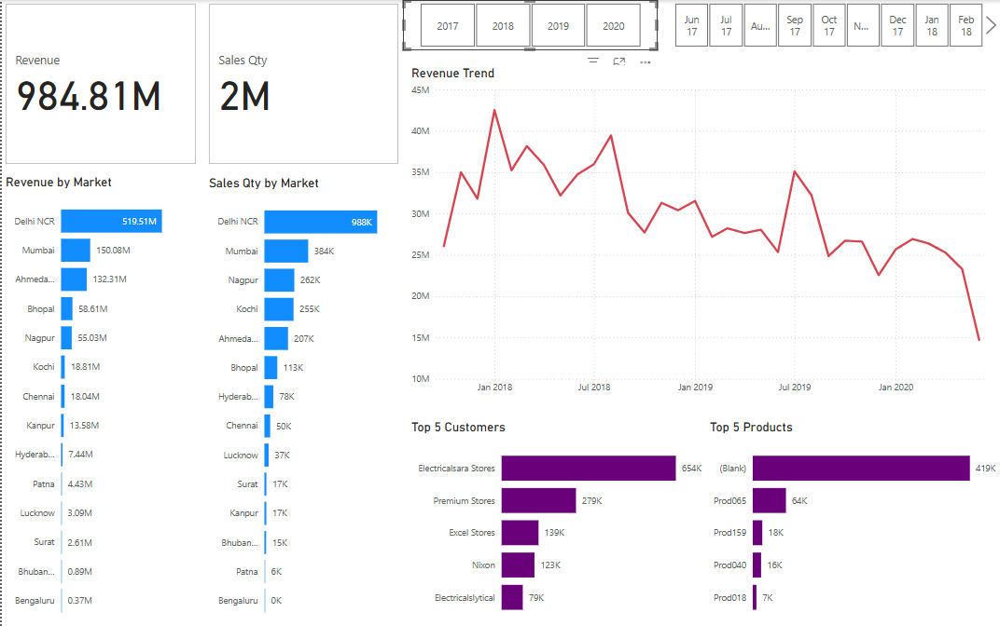
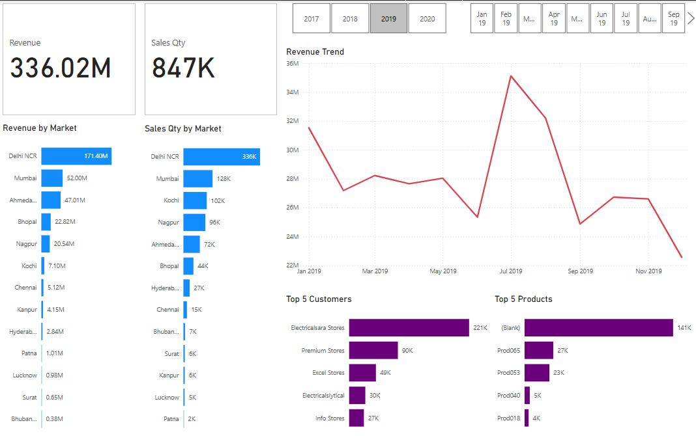
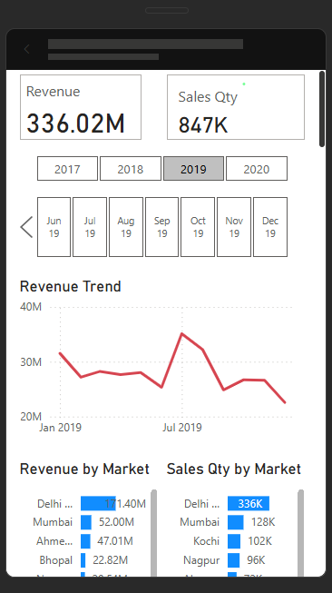

# 📊 Sales Insight Data Analytics Dashboard (Power BI)

This project presents an interactive **Sales Insight Dashboard** developed in **Power BI** to analyze multi-year sales data, providing business stakeholders with meaningful and actionable insights.

---

## 🚀 Project Objective
To empower sales teams and decision-makers with:
- Real-time revenue and quantity insights across Indian markets
- Product and customer performance analytics
- Historical trend analysis with year and month filters
- Interactive and intuitive dashboards for executive reviews

---

## 🛠️ Tools & Technologies
- **Power BI**
- **Excel** (for data preprocessing)
- **DAX** (Data Analysis Expressions)
- **Power Query**

---

## 📊 Sales Insights You Can Derive

The dashboard enables business teams to extract actionable insights such as:

- **Top-performing markets** based on revenue and sales quantity (e.g., Delhi NCR leads with ₹171.40M revenue)
- **Monthly revenue trends** to identify seasonality, dips, and peak periods
- **Product popularity** through the Top 5 products bar chart (e.g., `Prod065` consistently ranks high)
- **Customer segmentation** with contribution analysis of high-value clients like Electricalsara Stores
- **Sales performance by year and month**, filtered through intuitive slicers
- **Underperforming regions and products** for strategic planning and targeted improvements
- **Responsive visual layout** allowing stakeholders to analyze insights across devices (desktop and mobile)

These insights help stakeholders make **data-driven decisions** in pricing, marketing, distribution, and customer targeting.

---

## 📈 Dashboard Features
- **KPI Cards** for Revenue (`₹984.81M`, `₹336.02M`) and Sales Quantity (`2M`, `847K`)
- **Revenue & Sales by Market** visualizations
- **Time Slicers** (Year & Month) to analyze trends from 2017–2020
- **Revenue Trend Line Chart** with growth patterns and seasonal dips
- **Top 5 Customers and Products** for targeted business strategy
- **Responsive layout** with mobile-optimized viewing experience

---

## 📸 Screenshots

### 🔹 Full Overview (All-Time)

### 🔹 Year-Specific Analysis (2019 Focus)

### 🔹 Mobile View

---

## 📁 Files Included
- `Sales Insight Data Analysis Project.pbix` — Full Power BI dashboard file
- `images/dashboard-overview.png` — All-time sales snapshot
- `images/dashboard-2019.png` — 2019-focused analytics view
- `images/dashboard-mobile.png` — Responsive mobile layout
- `README.md` — This documentation

---

## 📌 Author

**Neeladri Bandopadhyay**  
📧 [contact.neeladri@gmail.com](mailto:contact.neeladri@gmail.com)  
🔗 [LinkedIn](https://www.linkedin.com/in/neeladri-bandopadhyay-92bb8824b/)  
🌐 [Portfolio Website](https://neel77mahi.github.io/portfolio-website/)  
💻 [GitHub](https://github.com/Neel77Mahi)

---

## 📝 License
This project is open for academic and portfolio purposes. Attribution is appreciated.
